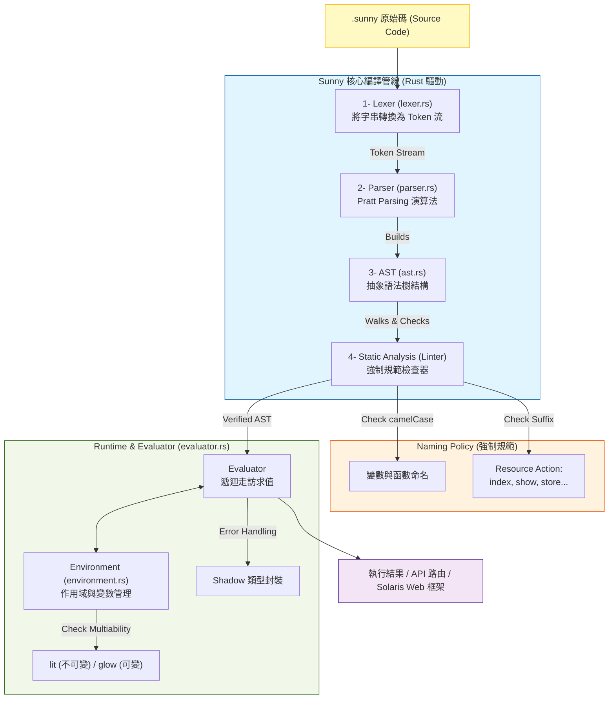

# ☀️ Sunny 語言開發規格總綱

## 一、 核心設計哲學

- **Solaris 原則**：代碼必須像陽光一樣透明，嚴禁任何隱晦的轉型與黑箱邏輯。
    
- **強制工程化**：透過編譯/解釋期的強制檢查（如 Resource Action），將後端規範直接寫入語言底層。
    
- **安全至上**：預設不可變性，並以 `Shadow` 類型取代不穩定的 Null/Exception 系統。
    

## 二、 語法規範與型別

## 1. 命名慣例 (Naming Conventions)

|**對象**|**規範**|**範例**|
|---|---|---|
|**變數 / 函數**|`camelCase`|`userStatus`, `orderStore()`|
|**常數**|`SCREAMING_SNAKE_CASE`|`MAX_RETRY_LIMIT`|
|**自定義類型**|`PascalCase`|`UserSession`|

## 2. 關鍵字與變數

- **`lit`** (Literal)：定義常數，賦值後不可變。
    
- **`glow`** (Glow)：定義變數，允許重新賦值。
    
- **`fn`**：定義函數（取代原先不討喜的名稱）。
    
- **`output`**：明確回傳值。
    

## 3. Resource Action (資源操作規範)

全局函數必須以指定動詞結尾，否則 Linter 將攔截執行：

- `index` (列表), `show` (單一), `store` (新增), `update` (更新), `remove` (刪除)。
    

## 三、 系統結構與目錄 (Project Structure)

我們將使用 Rust 構建這個語言，專案目錄規劃如下：

Plaintext

```
src/
├── main.rs          # 程式入口：處理 CLI 指令與啟動 REPL 互動模式
├── token.rs         # 詞法定義：使用 Enum 定義所有關鍵字、符號與字面量
├── lexer.rs         # 詞法分析：將字串原始碼轉換成 Token 流，處理 camelCase 識別
├── ast.rs           # 語法樹節點：定義 Statement 與 Expression 的樹狀結構
├── parser.rs        # 語法解析：實作 Pratt Parsing 演算法，將 Token 轉為 AST
├── environment.rs   # 作用域管理：儲存變數映射，並在此強制檢查 lit 不可變性
└── evaluator.rs     # 執行邏輯：遞迴走訪 AST 進行求值，處理 Shadow 邏輯與運算
```

## 四、 四個月開發進度表

## **M1：核心啟動 (The Core)**

- 完成從字串到 AST 的完整轉換。
    
- 實作靜態檢查器（Linter），強制驗證 `fn` 的後綴命名規範。
    
- **目標**：能在控制台執行基礎邏輯運算與函數調用。
    

## **M2：數據與安全 (Data & Safety)**

- 實作 `List` 與 `Map` 型別（對接 JSON）。
    
- 完善 `Shadow` 錯誤包裝機制。
    
- **目標**：能夠處理複雜的資料結構而不發生意外崩潰。
    

## **M3：後端動力 (Backend & Network)**

- 實作 `ray` 輕量級併發模型。
    
- 建立自動路由映射：`fn productIndex()` $\rightarrow$ `GET /product`。
    
- **目標**：啟動第一個由 Sunny 驅動的 HTTP Server。
    

## **M4：自給自足 (Self-hosting)**

- 實作 Markdown 解析與模板引擎。
    
- **終極目標**：發佈官方文檔系統，其所有後端 API 均由 Sunny 撰寫。
    

---

## 五、 錯誤處理範例

Sunny 強制開發者面對潛在的問題，而非假裝它們不存在：

程式碼片段

```
fn dataShow(id: Int) -> String | Shadow {
    if id < 0 {
        output Shadow("ID 必須為正數")
    }
    output "Valid Data"
}

lit result = dataShow(-1)
match result {
    is String val -> print(val)
    is Shadow s -> print("發現陰影：" + s.message)
}
```

---

這份規格書現在已經非常完整且具有高度的可執行性。它不僅是我們開發的藍圖，也是未來開源時的官方技術規格初稿。


這是一份使用 Mermaid 繪製的 **Sunny** 語言整體架構與底層運作邏輯圖。這張圖表展現了從原始碼輸入，經過 Rust 驅動的編譯管線，最後到執行與環境管理的完整流程。

程式碼片段



---

## 📥 底層運作邏輯解析

1. **詞法分析層 (Lexer)**：
    
    底層會將讀入的字元流進行正則匹配或狀態機掃描。它會特別識別你的關鍵字（如 `lit`, `glow`, `fn`），並將符合 `camelCase` 的字串標記為 `Ident`。
    
2. **語法解析層 (Parser)**：
    
    採用 **Pratt Parsing**。這是一種能優雅處理運算子優先級（如先乘除後加減）的演算法。它會將 Tokens 轉換為 `ast.rs` 中定義的樹狀結構，確保程式碼結構正確。
    
3. **規範檢查層 (Linter)**：
    
    這是 Sunny 的靈魂。在執行前，它會掃描 AST 中的所有 `FunctionDefinition` 節點。如果發現一個全局函數叫 `getData()` 而不是 `dataShow()`，它會直接在「編譯期」報錯，拒絕將 AST 傳給執行引擎。
    
4. **求值與環境層 (Evaluator & Environment)**：
    
    - **Environment** 是一個帶有 `outer` 指針的雜湊表（HashMap）。當你進入一個 `fn`，系統會建立一個新的 Environment，並將其 `outer` 指向全局。
        
    - **不可變性檢查**：在 `environment.rs` 中，當 `Evaluator` 發出修改請求時，它會先檢查該 Key 是否被標記為 `lit`。如果是，則拋出「陽光下禁止修改恆星」的錯誤訊息。
        
5. **錯誤安全網 (Shadow System)**：
    
    底層不使用 Rust 的 `panic!` 或傳統的異常。所有的不確定行為都會被包裝成 `Shadow` 物件，並在 `Evaluator` 中強制要求 `match` 處理。
    

---

